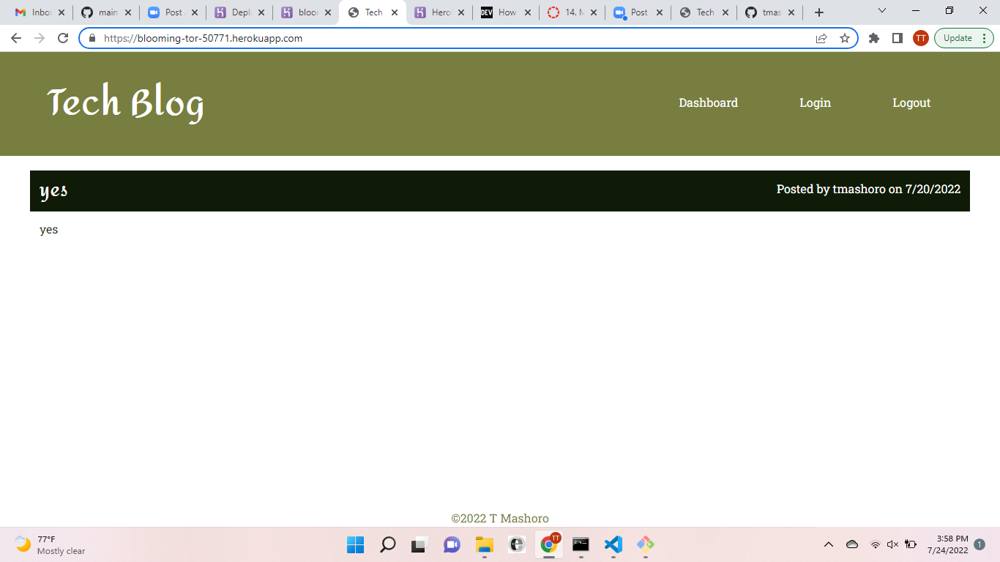

# Tech-Blog

## Description

This is a  a CMS-style blog site similar to a Wordpress site, where developers can publish their blog posts and comment on other developers’ posts as well. The app follows the MVC paradigm in its architectural structure, using Handlebars.js as the templating language, Sequelize as the ORM, and the express-session npm package for authentication.

## Table Of Contents

* [Installations](#dependencies)

* [Usage](#usage)

* [License](#license)

* [Contributors](#contributors)

* [Test](#test)

## dependencies

To install dependencies, run the following code:

npm init\
npm install express\
npm install sequalize\
npm install dotenv\
npm install mysql2\
npm install handlebars

## usage

.png)

## license

Copyright © MIT. All rights reserved.

      Licensed under the MIT license.

## contributors

Terrence Mashoro
[tmashoro](https://github.com/tmashoro/)\
[Contact Info] (tmashoro@gmail.com)

## test
